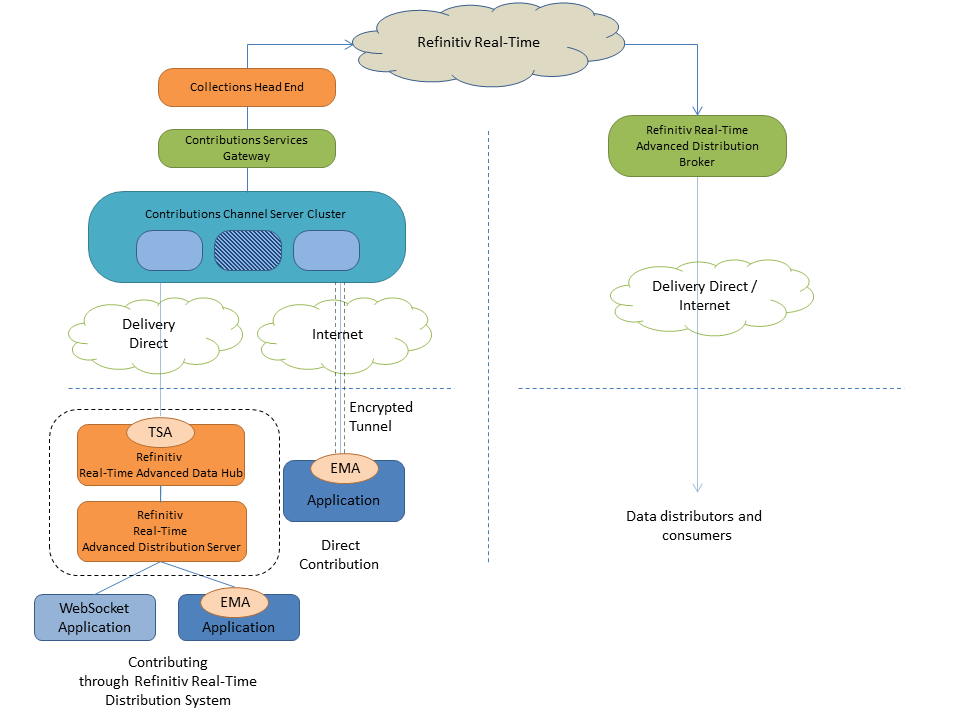
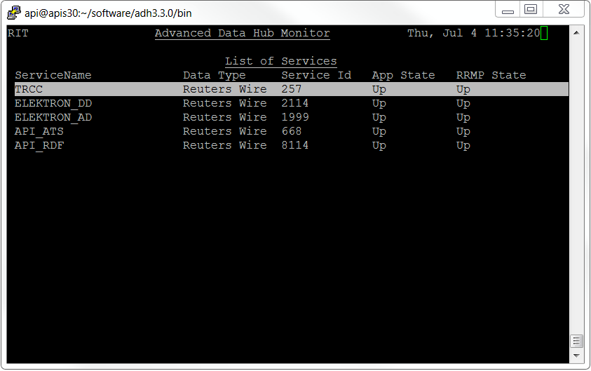
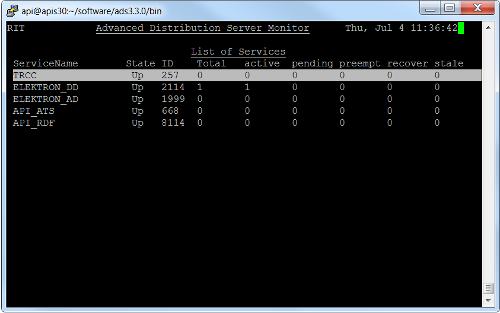

# Contributing your data to Refinitiv with Elektron WebSocket API
- Last update: July 2019
- Environment: Windows and Linux OS 
- Compiler: Python
- Prerequisite: ADS and ADH servers version 3.2.1 and above, TRCC Access Credentials

## TRCC Overview

The Thomson Reuters Contribution Channel (TRCC) is a new service for on-boarding content to the Refinitiv. Depending on the client's needs, access to the service will be fulfilled by one or more of the following products: Contributions Channel for TREP, Contributions Channel for Elektron API, Contributions Channel for Spreadsheet. TRCC aims for replacing the legacy Market Link IP (MLIP) system.

Data Contribution is a means to send your pricing data directly to Refinitiv , from where it can fan out globally. Leading market participants, such as banks and brokers, use Refinitiv to publish and distribute their information to the community of financial professions, in order to advertise their prices to clients and prospects.

## Application Overview

This example shows how to writing an application to contribute your data to TRCC using [Elektron WebSocket API](https://developers.refinitiv.com/elektron/websocket-api) through Thomson Reuters Enterprise Platform (TREP). The example just connects to TREP via a WebSocket connection, then sends an off-stream post to contribute item to TRCC server via that TREP. The project are implemented with Python language for both console and Jupyter Notebook applications, but the main concept and post message structures are the same for all technologies. 

If you are interested to contribute data using the RSSL connection (with or without TREP), please visit the following series of Elektron SDK and TRCC based on your prefer API: 
* [Contributing your data to Thomson Reuters article](https://developers.refinitiv.com/article/contributing-your-data-thomson-reuters).
* [EMA Java Tutorial - Posting data to TR Contribution Channel](https://developers.refinitiv.com/elektron/elektron-sdk-java/learning?content=41885&type=learning_material_item).
* [EMA C++ Tutorial - Posting data to TR Contribution Channel](https://developers.refinitiv.com/elektron/elektron-sdk-cc/learning?content=26452&type=learning_material_item).

If you are not familiar with Elektron WebSocket API Posting concept, please visit [Contributing Data to TREP using the Websocket API](https://developers.refinitiv.com/article/contributing-data-trep-using-websocket-api) article which will give you a full explanation of the WebSocket API Posting mechanisms and process.

*Note:* In an off-stream post, the client application can send a post for an item via a Login stream, regardless of whether a data stream first exists. The route of the post is determined by the TREP (ADS and ADH) configuration.

## Contribution Setups

The Elektron WebSocket API cannot connect to TRCC server directly (only Elektron SDK C++ and Java APIs support that feature). It requires TREP version 3.2.1 (and above) to take care of the JSON-OMM conversion, TRCC connection and login process for the WebSocket application.

 

The TREP infrastructure connects to TRCC through the delivery direct network via Tunnel Stream Aggregator (TSA) adapter, which is a private network (TLS encrypted) between a client site and Refinitiv. The TSA adapter is already packaged with the ADH version 3.2, and needs to be configured. You can find more detail regarding the TREP-TRCC configurations in [Contributing your data to Thomson Reuters article](https://developers.refinitiv.com/article/contributing-your-data-thomson-reuters) page (*Contribution through TREP* section). This example also contain example ADH-TRCC configurations in *trep_config/rmds_trcc.cnf* file.

## Prerequisite
This example requires the following dependencies softwares and libraries.
1. TREP server (both ADS and ADH) 3.2.x with WebSocket connection.
2. [Python](https://www.python.org/) compiler and runtime
3. Python's [requests 2.x](https://pypi.org/project/requests/) library.
4. Python's [websocket-client](https://pypi.org/project/websocket-client/) library (*version 0.49 or greater*).
5. [Jupyter Notebook](https://jupyter.org/) runtime (for the Notebook example application)
6. [Docker Engine - Community Edition](https://docs.docker.com/install/) (for running the console example in Docker only)
7. TRCC username, password and host list credentials. Please reach out to your Refinitiv sales associate to acquire TRCC access credentials.

*Note:* 
- The Python example has been qualified with Python versions 3.6.8. 
- Please refer to the [pip installation guide page](https://pip.pypa.io/en/stable/installing/) if your environment does not have the [pip tool](https://pypi.org/project/pip/) installed. 
- If your environment already have a websocket-client library installed, you can use ```pip list``` command to verify a library version, then use ```pip install --upgrade websocket-client``` command to upgrade websocket-client library. 
- You can install Jupyter Notebook on your local machine and then test the example on the machine. The alternate choice is a free Jupyter Notebook on cloud environment such as [Azure Notebook](https://notebooks.azure.com/) provided by Microsoft. You can find more details from [this tutorial](https://docs.microsoft.com/en-us/azure/notebooks/tutorial-create-run-jupyter-notebook). If you are not familiar with Jupyter Notebook, the following [tutorial](https://www.datacamp.com/community/tutorials/tutorial-jupyter-notebook) created by DataCamp may help.
- It is not advisable to change the ADH configuration, if you are not familiar with the configuration procedures. Please consult your Market Data administrator for any questions regarding ADH-TRCC configuration.

## Application Files
This example project contains the following files and folders
1. *console_python/trcc_posting.py*: The example application file
2. *console_python/requirements.txt*: The application dependencies configurationf file
3. *console_python/Dockerfile*: The example application Dockerfile
4. *notebook_python/trcc_posting_notebook.ipynb*: The example Jupyter Notebook application file
5. *trep_config/rmds_trcc.cnf*: ADH TRCC configurations example file (*not a completed ADH configuration file*)
6. LICENSE.md: Project's license file
7. README.md: Project's README file

## How to run this console example

Please be informed that your TREP server (ADS and ADH) should be applied the TRCC configurations and TRCC contribution service should be "Up" before running an example. The TRCC access credentials are required in the connection between ADH server and TRCC server only, not in the application level. 

 

 

1. Unzip or download the example project folder into a directory of your choice. 
2. Enter project *console* folder.
3. Run ```$> pip install -r requestments.txt``` command in a console to install all the dependencies libraries.
4. Then you can run trcc_posting.py application with the following command
    ```
    $> python trcc_post.py --hostname <ADS server IP Address/Hostname> --port <WebSocket Port> --item <Contribution item name> --service <ADS Contribution Service name>
    ```

## How to run this console example in Docker

1. Unzip or download the example project folder into a directory of your choice. 
2. Enter *console* folder.
3. Run ```$> docker build -t <project tag name> .``` command in a console to build an image from a Dockerfile.
    ```
    $> docker build -t esdk_ws_trcc_python .
    ```
4. Once the build is success, you can create and run the container with the following command
    ```
    $> docker run esdk_ws_trcc_python --hostname <ADS server IP Address/Hostname> --port <WebSocket Port> --item <Contribution item name> --service <ADS Contribution Service name>
    ```

## Example Results
### Initiate and Login to TREP
```
Connecting to WebSocket ws://localhost:15000/WebSocket ...
WebSocket successfully connected!
SENT:
{
  "Domain":"Login",
  "ID":1,
  "Key":{
    "Elements":{
      "ApplicationId":"256",
      "Position":"10.42.68.162"
    },
    "Name":"root"
  }
}
RECEIVED:
[
  {
    "Domain":"Login",
    "Elements":{
      "MaxMsgSize":61430,
      "PingTimeout":30
    },
    "ID":1,
    "Key":{
      "Elements":{
        "AllowSuspectData":1,
        "ApplicationId":"256",
        "ApplicationName":"ADS",
        "Position":"10.42.68.162",
        "ProvidePermissionExpressions":1,
        "ProvidePermissionProfile":0,
        "SingleOpen":1,
        "SupportBatchRequests":7,
        "SupportEnhancedSymbolList":1,
        "SupportOMMPost":1,
        "SupportOptimizedPauseResume":1,
        "SupportPauseResume":1,
        "SupportStandby":1,
        "SupportViewRequests":1
      },
      "Name":"root"
    },
    "State":{
      "Data":"Ok",
      "Stream":"Open",
      "Text":"Login accepted by host apis30."
    },
    "Type":"Refresh"
  }
]
```

### Contribution data via an Off-Stream Post message
```
Sending Off-Stream Post to TREP Server
SENT:
{
  "Ack":true,
  "Domain":"MarketPrice",
  "ID":1,
  "Key":{
    "Name":"<CONTRIBUTION_RIC>",
    "Service":"<CONTRIBUTION_Service>"
  },
  "Message":{
    "Domain":"MarketPrice",
    "Fields":{
      "ASK":35.48,
      "BID":34.25,
      "PRIMACT_1":116.5
    },
    "ID":0,
    "Key":{
      "Name":"<CONTRIBUTION_RIC>",
      "Service":"<CONTRIBUTION_Service>"
    },
    "Type":"Update"
  },
  "PostID":1,
  "PostUserInfo":{
    "Address":"10.42.68.162",
    "UserID":256
  },
  "Type":"Post"
}
Here
RECEIVED: 
[
  {
    "AckID":1,
    "ID":1,
    "Key":{
      "Name":"<CONTRIBUTION_RIC>",
      "Service":"<CONTRIBUTION_Service>"
    },
    "Type":"Ack"
  }
]
```

## References
* [Refinitiv Elektron SDK Family page](https://developers.refinitiv.com/elektron) on the [Refinitiv Developer Community](https://developers.thomsonreuters.com/) web site.
* [Refinitiv Elektron WebSocket API page](https://developers.refinitiv.com/websocket-api).
* [Developer Webinar Recording: Introduction to Electron WebSocket API](https://www.youtube.com/watch?v=CDKWMsIQfaw).
* [Contributing Data to TREP using the Websocket API article](https://developers.refinitiv.com/article/contributing-data-trep-using-websocket-api).
* [Contributing your data to Thomson Reuters article](https://developers.refinitiv.com/article/contributing-your-data-thomson-reuters).
* [Refinitiv Elektron: RIC Search](https://developers.refinitiv.com/elektron/websocket-api/dev-tools?type=ric).
* [Refinitiv Data Model Discovery page](https://refinitiv.fixspec.com/specserver/specs/reuters): Explore TR data models, content definitions and data update behaviors.
* [EMA Java Tutorial - Posting data to TR Contribution Channel](https://developers.refinitiv.com/elektron/elektron-sdk-java/learning?content=41885&type=learning_material_item).
* [EMA C++ Tutorial - Posting data to TR Contribution Channel](https://developers.refinitiv.com/elektron/elektron-sdk-cc/learning?content=26452&type=learning_material_item).

For any question related to this example or Elektron WebSocket API, please use the Developer Community [Q&A Forum](https://community.developers.refinitiv.com/spaces/152/websocket-api.html).