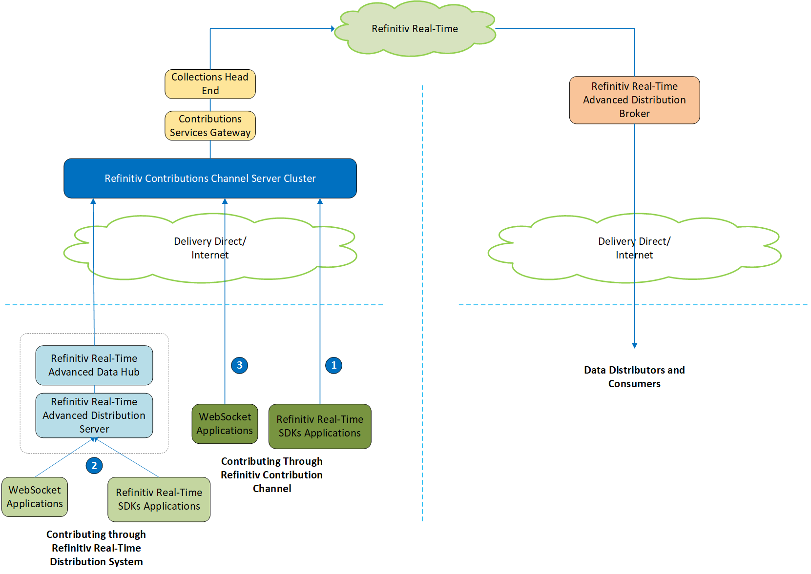

# Contributing your data to Refinitiv with WebSocket API and Refinitiv Real-Time Distribution System
- Last update: September 2021
- Environment: Windows and Linux OS 
- Compiler: Python
- Prerequisite: Refinitiv Real-Time Distribution servers version 3.2.1 and above, RCC Access Credentials

## RCC Overview

The Refinitiv Contribution Channel (RCC) is a new service for on-boarding content to Refinitiv. Depending on the client's needs, access to the service will be fulfilled by one or more of the following products: Contributions Channel for Refinitiv Real-Time Advanced Distribution Server/Advanced Data Hub Server, Contributions Channel for Real-Time API, Contributions Channel for Spreadsheet. RCC aims for replacing the legacy Market Link IP (MLIP) system.

Data Contribution is a means to send your pricing data directly to Refinitiv , from where it can fan out globally. Leading market participants, such as banks and brokers, use Refinitiv to publish and distribute their information to the community of financial professions, in order to advertise their prices to clients and prospects.

## Application Overview

This example shows how to writing an application to contribute your data to RCC using [Websocket API for Pricing Streaming and Real-Time Service](https://developers.refinitiv.com/en/api-catalog/refinitiv-real-time-opnsrc/refinitiv-websocket-api) (aka WebSocket API) through Refinitiv Real-Time Distribution System (Refinitiv Real-Time Advanced Distribution and Advanced Data Hub servers). The example just connects to Refinitiv Real-Time Advanced Distribution Server via a WebSocket connection, then sends an off-stream post to contribute item to RCC server via that Refinitiv Real-Time Distribution System. The project are implemented with Python language for both console and Jupyter Notebook applications, but the main concept and post message structures are the same for all technologies. 

If you are interested to contribute data using the RSSL connection (with or without Refinitiv Real-Time Distribution System)), please visit the following series of Real-Time SDK and RCC based on your prefer API: 
* [Contributing your data to Refinitiv article](https://developers.refinitiv.com/en/article-catalog/article/contributing-your-data-refinitiv).
* [EMA Java Tutorial - Posting data to Contribution Channel](https://developers.refinitiv.com/en/api-catalog/refinitiv-real-time-opnsrc/rt-sdk-java/tutorials#ema-consumer-posting-data-to-contribution-channel).
* [EMA C++ Tutorial - Posting data to Contribution Channel](https://developers.refinitiv.com/en/api-catalog/refinitiv-real-time-opnsrc/rt-sdk-cc/tutorials#ema-consumer-posting-data-to-contribution-channel).

If you are not familiar with WebSocket API Posting concept, please visit [Contributing Data to Refinitiv Real-Time using the Websocket API](https://developers.refinitiv.com/en/article-catalog/article/contributing-data-trep-using-websocket-api) article which will give you a full explanation of the WebSocket API Posting mechanisms and process.

*Note:* In an off-stream post, the client application can send a post for an item via a Login stream, regardless of whether a data stream first exists. The route of the post is determined by the Refinitiv Real-Time Distribution System configuration.

## Contribution Setups

**Update (As of March 2021)**: The direct Websocket access to Contributions Channel Tutorial is available [here](https://developers.refinitiv.com/en/api-catalog/elektron/refinitiv-websocket-api/tutorials#contributing-data-to-refinitiv-contributions-channel). 

Developers can contributing data to RCC with Real-Time SDK C++/Java (RSSL connection) and WebSocket API (WebSocket connection). Currently, there are three methods to contribute data to the RCC. 

1. **Use Refinitiv Real-Time SDKs to directly connect to RCC to contribute data.** To use this method, please refer to the following tutorials:
  * [ETA C/C++ Consumer - Posting data to Contributions Channel](https://developers.refinitiv.com/en/api-catalog/refinitiv-real-time-opnsrc/rt-sdk-cc/tutorials#eta-consumer-posting-data-to-contribution-channel)
  * [EMA C/C++ Consumer - Posting data to Contributions Channel](https://developers.refinitiv.com/en/api-catalog/refinitiv-real-time-opnsrc/rt-sdk-cc/tutorials#ema-consumer-posting-data-to-contribution-channel)
  * [ETA Java Consumer - Posting data to Contributions Channel](https://developers.refinitiv.com/en/api-catalog/refinitiv-real-time-opnsrc/rt-sdk-java/tutorials#eta-tutorial-7-posting-data-to-contributions-channel)
  * [EMA Java Consumer - Posting data to Contributions Channel](https://developers.refinitiv.com/en/api-catalog/refinitiv-real-time-opnsrc/rt-sdk-java/tutorials#ema-consumer-posting-data-to-contribution-channel)

2. **Use Refinitiv Real-Time SDKs or WebSocket API for contributing data to RCC via Refinitiv Real-Time Distribution System.** To use this method, please refer to the following the [first article](https://developers.refinitiv.com/en/article-catalog/article/contributing-your-data-refinitiv) and continue on *this article*:

3. **Use WebSocket API to directly connect to RCC to contribute data.** To use this method, please refer to the following the [Contributing Data to Refinitiv Contributions Channel (RCC) via WebSocket tutorial page](https://developers.refinitiv.com/en/api-catalog/refinitiv-real-time-opnsrc/refinitiv-websocket-api/tutorials#contributing-data-to-refinitiv-contributions-channel). 

This article is focusing on **the second method** which is contributing data via Refinitiv Real-Time Distribution System servers (Real-Time Advanced Distribution and Advanced Data Hub servers).  The servers will take care of the RCC connection, JSON-OMM conversion, and login process for the application.

 

The Refinitiv Real-Time Advanced Data Hub server connects to RCC through the delivery direct network via Tunnel Stream Aggregator (TSA) adapter, which is a private network (TLS encrypted) between a client site and Refinitiv. The TSA adapter is already packaged with the  Advanced Data Hub version 3.2, and needs to be configured. You can find more detail regarding the Advanced Data Hub-RCC configurations on [Contributing your data to Refinitiv article](https://developers.refinitiv.com/en/article-catalog/article/contributing-your-data-refinitiv) page. This example also contain example Advanced Data Hub-RCC configurations in *trep_config/rmds_trcc.cnf* file.

## Prerequisite
This example requires the following dependencies softwares and libraries.
1. Refinitiv Real-Time Advanced Data Hub and Refinitiv Real-Time Advanced Distribution servers 3.2.x with WebSocket connection.
2. [Python](https://www.python.org/) compiler and runtime
3. Python's [requests 2.x](https://pypi.org/project/requests/) library.
4. Python's [websocket-client](https://pypi.org/project/websocket-client/) library (*version 0.49 or greater*).
5. [Jupyter Notebook](https://jupyter.org/) runtime (for the Notebook example application)
6. [Docker Engine - Community Edition](https://docs.docker.com/install/) (for running the console example in Docker only)
7. RCC username, password and host list credentials. Please reach out to your Refinitiv sales associate to acquire RCC access credentials.

*Note:* 
- The Python example has been qualified with Python versions 3.6.8. 
- Please refer to the [pip installation guide page](https://pip.pypa.io/en/stable/installing/) if your environment does not have the [pip tool](https://pypi.org/project/pip/) installed. 
- If your environment already have a websocket-client library installed, you can use ```pip list``` command to verify a library version, then use ```pip install --upgrade websocket-client``` command to upgrade websocket-client library. 
- You can install Jupyter Notebook on your local machine and then test the example on the machine. The alternate choice is a free Jupyter Notebook on cloud environment such as [Azure Notebook](https://notebooks.azure.com/) provided by Microsoft. You can find more details from [this tutorial](https://docs.microsoft.com/en-us/azure/notebooks/tutorial-create-run-jupyter-notebook). If you are not familiar with Jupyter Notebook, the following [tutorial](https://www.datacamp.com/community/tutorials/tutorial-jupyter-notebook) created by DataCamp may help.
- It is not advisable to change the ADH configuration, if you are not familiar with the configuration procedures. Please consult your Market Data administrator for any questions regarding ADH-RCC configuration.

## Application Files
This example project contains the following files and folders
1. *console_python/trcc_posting.py*: The example application file
2. *console_python/requirements.txt*: The application dependencies configuration file
3. *console_python/Dockerfile*: The example application Dockerfile
4. *notebook_python/trcc_posting_notebook.ipynb*: The example Jupyter Notebook application file
5. *trep_config/rmds_trcc.cnf*: ADH RCC configurations example file (*not a completed ADH configuration file*)
6. LICENSE.md: Project's license file
7. README.md: Project's README file

## How to run this console example

Please be informed that your Refinitiv Real-Time Advanced Data Hub and Real-Time Advanced Distribution servers should be applied the RCC configurations and RCC contribution service should be "Up" before running an example. The RCC access credentials are required in the connection between ADH server and RCC server only, not in the application level. 

 

 

1. Unzip or download the example project folder into a directory of your choice. 
2. Enter project *console* folder.
3. Run ```$> pip install -r requirements.txt``` command in a console to install all the dependencies libraries.
4. Then you can run trcc_posting.py application with the following command
    ```
    $> python trcc_post.py --hostname <Real-Time Advanced Distribution server IP Address/Hostname> --port <WebSocket Port> --item <Contribution item name> --service <Real-Time Advanced Distribution server Contribution Service name>
    ```

## How to run this console example in Docker

1. Unzip or download the example project folder into a directory of your choice. 
2. Enter *console* folder.
3. Run ```$> docker build -t <project tag name> .``` command in a console to build an image from a Dockerfile.
    ```
    $> docker build -t esdk_ws_rcc_python .
    ```
4. Once the build is success, you can create and run the container with the following command
    ```
    $> docker run esdk_ws_rcc_python --hostname <Real-Time Advanced Distribution server IP Address/Hostname> --port <WebSocket Port> --item <Contribution item name> --service <Real-Time Advanced Distribution server Contribution Service name>
    ```

*Note*: If you want to connect a docker application to your *localhost* Real-Time Advanced Distribution server, please refer to this [Stack Overflow answer page](https://stackoverflow.com/questions/24319662/from-inside-of-a-docker-container-how-do-i-connect-to-the-localhost-of-the-mach).

## Example Results
### Initiate and Login to Real-Time Advanced Distribution server
```
Connecting to WebSocket ws://localhost:15000/WebSocket ...
WebSocket successfully connected!
SENT:
{
  "Domain":"Login",
  "ID":1,
  "Key":{
    "Elements":{
      "ApplicationId":"256",
      "Position":"10.42.68.162"
    },
    "Name":"root"
  }
}
RECEIVED:
[
  {
    "Domain":"Login",
    "Elements":{
      "MaxMsgSize":61430,
      "PingTimeout":30
    },
    "ID":1,
    "Key":{
      "Elements":{
        "AllowSuspectData":1,
        "ApplicationId":"256",
        "ApplicationName":"ADS",
        "Position":"10.42.68.162",
        "ProvidePermissionExpressions":1,
        "ProvidePermissionProfile":0,
        "SingleOpen":1,
        "SupportBatchRequests":7,
        "SupportEnhancedSymbolList":1,
        "SupportOMMPost":1,
        "SupportOptimizedPauseResume":1,
        "SupportPauseResume":1,
        "SupportStandby":1,
        "SupportViewRequests":1
      },
      "Name":"root"
    },
    "State":{
      "Data":"Ok",
      "Stream":"Open",
      "Text":"Login accepted by host apis30."
    },
    "Type":"Refresh"
  }
]
```

### Contribution data via an Off-Stream Post message
```
Sending Off-Stream Post to Real-Time Advanced Distribution server
SENT:
{
  "Ack":true,
  "Domain":"MarketPrice",
  "ID":1,
  "Key":{
    "Name":"<CONTRIBUTION_RIC>",
    "Service":"<CONTRIBUTION_Service>"
  },
  "Message":{
    "Domain":"MarketPrice",
    "Fields":{
      "ASK":35.48,
      "BID":34.25,
      "PRIMACT_1":116.5
    },
    "ID":0,
    "Key":{
      "Name":"<CONTRIBUTION_RIC>",
      "Service":"<CONTRIBUTION_Service>"
    },
    "Type":"Update"
  },
  "PostID":1,
  "PostUserInfo":{
    "Address":"10.42.68.162",
    "UserID":256
  },
  "Type":"Post"
}
Here
RECEIVED: 
[
  {
    "AckID":1,
    "ID":1,
    "Key":{
      "Name":"<CONTRIBUTION_RIC>",
      "Service":"<CONTRIBUTION_Service>"
    },
    "Type":"Ack"
  }
]
```

## References
* [Refinitiv Real-Time & Distribution](https://developers.refinitiv.com/en/use-cases-catalog/refinitiv-real-time) on the [Refinitiv Developer Community](https://developers.refinitiv.com/) web site.
* [Websocket API for Pricing Streaming and Real-Time Services page](https://developers.refinitiv.com/en/api-catalog/refinitiv-real-time-opnsrc/refinitiv-websocket-api).
* [Developer Webinar Recording: Introduction to WebSocket API](https://www.youtube.com/watch?v=CDKWMsIQfaw).
* [Contributing Data to Refinitiv Real-Time using the Websocket API article](https://developers.refinitiv.com/en/article-catalog/article/contributing-data-trep-using-websocket-api).
* [Contributing your data to Refinitiv article](https://developers.refinitiv.com/en/article-catalog/article/contributing-your-data-refinitiv).
* [Contributing Data to Refinitiv Contributions Channel (RCC) via WebSocket Tutorial](https://developers.refinitiv.com/en/api-catalog/elektron/refinitiv-websocket-api/tutorials#contributing-data-to-refinitiv-contributions-channel).
* [EMA Java Tutorial - Posting data to Contribution Channel](https://developers.refinitiv.com/en/api-catalog/refinitiv-real-time-opnsrc/rt-sdk-java/tutorials#ema-consumer-posting-data-to-contribution-channel).
* [EMA C++ Tutorial - Posting data to Contribution Channel](https://developers.refinitiv.com/en/api-catalog/refinitiv-real-time-opnsrc/rt-sdk-cc/tutorials#ema-consumer-posting-data-to-contribution-channel).
* [Contributing Data to Refinitiv Contributions Channel (RCC) via WebSocket Tutorial](https://developers.refinitiv.com/en/api-catalog/refinitiv-real-time-opnsrc/refinitiv-websocket-api/tutorials#contributing-data-to-refinitiv-contributions-channel).

For any question related to this example or WebSocket API, please use the Developer Community [Q&A Forum](https://community.developers.refinitiv.com/spaces/152/websocket-api.html).